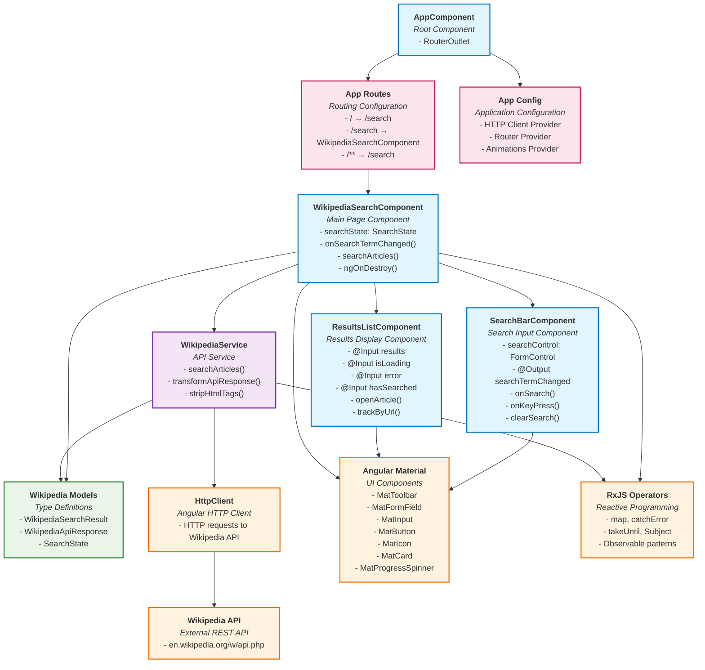
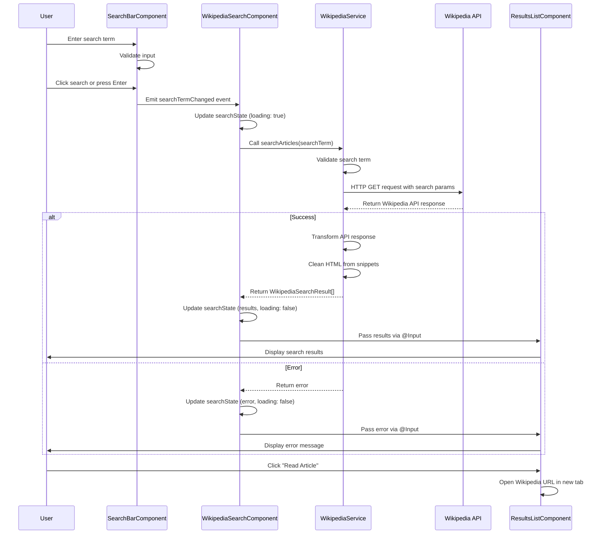

# Wikipedia Search App - Architecture Diagram

## Component Dependencies and Data Flow



## Data Flow Diagram



## Component Architecture Overview

### **Core Components Structure**

1. **AppComponent** (Root)
   - Minimal root component with RouterOutlet
   - Entry point for the application

2. **WikipediaSearchComponent** (Page)
   - Main container component
   - Manages search state and orchestrates child components
   - Handles business logic and data flow

3. **SearchBarComponent** (Feature)
   - Reusable search input component
   - Emits search events to parent
   - Handles user input validation

4. **ResultsListComponent** (Feature)
   - Displays search results in cards
   - Handles loading, error, and empty states
   - Responsive design with accessibility features

### **Services Layer**

1. **WikipediaService**
   - Encapsulates Wikipedia API interactions
   - Transforms API responses to application models
   - Handles error scenarios and data cleaning

### **Models and Types**

1. **Wikipedia Models**
   - Type-safe interfaces for API responses
   - Application-specific result models
   - Search state management types

### **Key Design Patterns Used**

- **Component Communication**: Parent-child via @Input/@Output
- **Service Injection**: Dependency injection for API service
- **Observable Patterns**: RxJS for async data handling
- **Reactive Forms**: FormControl for search input
- **Standalone Components**: Angular v19 approach
- **Lazy Loading**: Route-based component loading
- **Error Boundaries**: Graceful error handling
- **Accessibility**: ARIA labels and keyboard navigation

### **External Dependencies**

- **Angular Material**: UI component library
- **RxJS**: Reactive programming utilities
- **Angular HTTP Client**: API communication
- **Wikipedia API**: External data source

### **Benefits of This Architecture**

1. **Separation of Concerns**: Each component has a single responsibility
2. **Reusability**: Components can be easily reused or replaced
3. **Testability**: Services and components are easily unit testable
4. **Maintainability**: Clear dependency structure and modular design
5. **Type Safety**: TypeScript interfaces ensure data consistency
6. **Performance**: Lazy loading and OnPush change detection
7. **Accessibility**: Built-in a11y features throughout
8. **Responsive**: Mobile-first design approach

## File Structure Overview

```
src/app/
├── components/           # Reusable UI components
│   ├── search-bar/      # Search input component
│   └── results-list/    # Results display component
├── pages/               # Page-level components
│   └── wikipedia-search/ # Main search page
├── services/            # Business logic and API calls
│   └── wikipedia.service.ts
├── models/              # TypeScript interfaces
│   └── wikipedia.model.ts
├── app.component.*      # Root component
├── app.config.ts        # App configuration
└── app.routes.ts        # Routing configuration
```

*code generated by AI*
